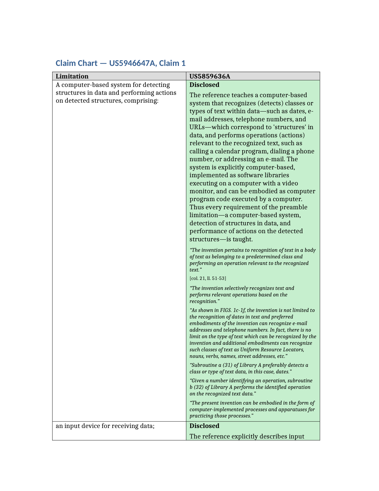

# patentkit

Modular, open-source toolkit for patent search and analysis. patentkit packages
the building blocks of a production patent-intelligence stack — data
connectors, a canonical patent data model, plug-and-play search infrastructure,
LLM analysis skills, agentic search workflows, document formatters, and evals —
and exposes them as **tools, skills, and plugins for both Anthropic (Claude /
MCP) and OpenAI (function tools / Agents SDK)**.

```
pip install patentkit            # core (pure python + pydantic/httpx)
pip install 'patentkit[all]'     # everything
```

Extras: `anthropic`, `openai`, `elasticsearch`, `docx`, `pdf`, `viz`, `mcp`, `scrape`.

## Demo: agentic invalidity search → claim chart

One toy IPR-style queryset end to end, built around Apple's US5946647A (the
'647 "data detectors" patent) with two real prior-art patents as ground truth:
the agent writes and refines its own queries over a 300-patent corpus of real
scraped patents, finds both ground-truth references, then charts claim 1
against the top hit — quoting the reference verbatim and locating every quote
in the issued PDF as a column/line citation. (The toy dataset's
"IPR2020-001xx" proceeding labels are illustrative placeholders, not real PTAB
citations — the actual IPR2020-00104 concerns an unrelated patent.)


*(Real captured output of `python examples/demo_invalidity_chart.py`, replayed
at readable speed with the middle search rounds elided.)*

The finished product is a color-coded DOCX claim chart — one row per atomic
limitation, quotes cited by column/line (e.g. `[col. 21, ll. 51-53]`, computed
by fuzzy-locating the quote in the patent PDF and regressing the printed
line-number gutter):



Run it yourself with `python examples/demo_invalidity_chart.py` (needs the
`pdf`, `docx`, and `scrape` extras plus an `ANTHROPIC_API_KEY` or
`OPENAI_API_KEY`; outputs land in `data/demo/`).

## Design principles

- **Bring your own keys.** Every connector, store, and model provider accepts
  an explicit `api_key=...` and falls back to a documented env var
  (`patentkit.config.KEY_REGISTRY` lists them all). Nothing phones home.
- **Sensible model defaults, routed by reasoning effort.** Tasks declare
  `low` / `medium` / `high` effort, not model ids. Defaults: Claude Haiku 4.5 /
  Sonnet 4.6 / Fable 5 (Anthropic) and gpt-5-mini / gpt-5.1 (OpenAI), all
  overridable in one place (`patentkit.llm.DEFAULT_MODELS`).
- **Everything degrades gracefully.** Everything runs offline with the
  in-memory BM25 store and no LLM key (searches fall back to a clearly-labeled
  single keyword pass); add keys and backends to turn quality up.
- **One canonical data model.** Every source parses into
  `patentkit.models.Patent`; `Patent.merge()` reconciles records from multiple
  sources with per-source fidelity and provenance (`sources`).

## Layout

| Package | What's in it |
|---|---|
| `patentkit.models` | Canonical patent data model + multi-source reconciliation |
| `patentkit.connectors.inference` | USPTO file wrapper (ODP), Google Patents page + search API |
| `patentkit.connectors.infra` | Google Patents large-scale scrape jobs, USPTO bulk XML, EPO OPS, PTAB/IPR, ETSI SEP declarations, product catalogs (Amazon via Rainforest, LLM web extraction) |
| `patentkit.connectors.training` | Examiner search-query log builder (from SRNT search reports), IPR eval-dataset builder |
| `patentkit.search` | `SearchQuery` full param set; BM25 (in-memory), Elasticsearch, vector/RAG stores (in-memory, ES dense-vector; OpenAI/Voyage embeddings), hybrid RRF fusion |
| `patentkit.parsing` | Claim parser, document text extraction, **PDF line-number regression** (cite passages as "col. 3, ll. 45–52") |
| `patentkit.analysis` | Invalidity (atomic limitations → disclosure assessment → claim charts), FTO, infringement, drafting skills + prompt library |
| `patentkit.formatting` | Claim charts (docx/markdown/html, color-coded, line-number citations), invalidity / FTO / infringement reports |
| `patentkit.agents` | Agentic invalidity / FTO / infringement search, invalidity charting, **guided search sessions** (plan → feedback → execute → iterate), time estimation |
| `patentkit.notify` | Slack webhook, SendGrid / SMTP email completion notifications |
| `patentkit.viz` | Patent-set topic clustering (KMeans/DBSCAN + LLM topic naming) |
| `patentkit.evals` | Search-performance harness, recall@k / MRR / MAP metrics, toy IPR dataset, user-built eval sets |
| `patentkit.integrations` | MCP server (`patentkit-mcp`), OpenAI tool definitions + agent loop, Word drafting add-in |
| `plugins/claude` | Claude Code plugin: skills (invalidity/FTO/infringement search, claim chart, drafting) + MCP wiring |

## Quickstart (offline, no keys)

```python
from patentkit.models import Patent, PatentNumber
from patentkit.search import BM25Store, SearchQuery
from patentkit.agents import InvaliditySearchAgent

store = BM25Store()
store.index(my_patents)                      # any Iterable[Patent]

agent = InvaliditySearchAgent(keyword_store=store)   # no LLM: degraded mode
target = store.get(PatentNumber.parse("US10123456B2"))
result = agent.search(target)                # examiner art excluded by default
for r in result.results[:10]:
    print(r["patent_number"], r["score"], r["passages"][0]["text"][:80])
```

See `examples/quickstart.py` for a runnable end-to-end demo.

## With LLMs and real data

```python
from patentkit.llm import get_llm
from patentkit.connectors.inference.google_patents import fetch_patent
from patentkit.connectors.inference.file_wrapper import FileWrapperClient

llm = get_llm("high")                        # -> claude-fable-5 by default
# or: get_llm("high", provider="openai")     # -> gpt-5.1 (reasoning effort high)

patent = fetch_patent("US10123456B2")        # Google Patents scrape -> canonical Patent
patent = FileWrapperClient().enrich_patent(patent)   # + prosecution history, examiner art

agent = InvaliditySearchAgent(keyword_store=store, vector_store=vstore, llm=llm)
result = agent.search(patent, claims=[1])
```

## Guided search (the user-facing flow)

The guided flow is what the Claude skills / OpenAI tools drive:

1. `guided_search_start` — derives a **plan preview** (the starting query
   angles, exclusions, date cutoff) plus an **estimated completion time**.
2. The user reviews the preview; feedback on whole results, individual
   passages, or individual queries is structured (`patentkit.agents.feedback`).
3. `guided_search_execute` — runs the **agentic search**: one LLM agent
   iteratively generates queries, executes them as tools, reads the results,
   refines, and finishes with ranked candidates — under a time budget, with a
   full saved reasoning trace (`get_search_trace`). Examiner-cited art from
   the file wrapper, family members, and the target itself are excluded by
   default at the tool layer (overridable).
4. `guided_search_feedback` — queued and injected into the SAME resumed agent
   conversation on the next execute; iterate until satisfied.

Sessions are JSON-serializable, so the loop works across chat turns in any
agent harness.

## Exposing patentkit to Claude and OpenAI

**MCP (Claude Desktop, Claude Code, any MCP client):**

```jsonc
// .mcp.json
{ "mcpServers": { "patentkit": { "command": "patentkit-mcp" } } }
```

**Claude Code plugin** — `plugins/claude/` ships skills
(`/invalidity-search`, `/fto-search`, `/infringement-search`, `/claim-chart`,
`/patent-drafting`) plus the MCP server wiring.

**OpenAI:**

```python
from patentkit.integrations.toolset import PatentToolset
from patentkit.integrations.openai_tools import openai_tool_definitions, handle_tool_call

tools = openai_tool_definitions()   # pass to responses.create(tools=...)
# dispatch tool calls back through handle_tool_call(toolset, name, args_json)
```

Note on OpenAI surfaces: the 2023 "ChatGPT plugins" system is retired. The
current equivalents are (a) function tools in the API — exactly what
`openai_tool_definitions()` ships — and (b) MCP: the Responses API has a
built-in `mcp` tool type for remote MCP servers, and ChatGPT supports custom
connectors/apps backed by remote MCP. patentkit's MCP server (`patentkit-mcp`)
works there too, not just with Claude — it runs locally over stdio, so for
OpenAI's remote-MCP integrations expose it at an HTTP endpoint they can reach.

**Word add-in** — `integrations/word-plugin/` is an Office.js taskpane for
patent drafting (draft claims, check antecedent basis, draft spec sections)
backed by a local patentkit HTTP server.

## Evals

```python
from patentkit.evals import EvalRunner, default_ipr_toy_dataset

report = EvalRunner(my_search_fn, default_ipr_toy_dataset()).run()
print(report.to_markdown())   # recall@k curves, MRR, MAP
```

Ships with a clearly-labeled toy IPR dataset; build real ones with
`patentkit.connectors.training.ipr_datasets` (PTAB final decisions → ground
truth) or from user feedback via `UserEvalSetBuilder`.

**Reproduce the IPR-example experiments from a fresh clone** with
`scripts/eval_e2e.sh`: it provisions a local Dockerized Elasticsearch, builds
(or reuses) the live-scraped 300-patent corpus, indexes it, and runs the
invalidity eval twice — keys-free baseline, then the full agentic loop if
`ANTHROPIC_API_KEY`/`OPENAI_API_KEY` is set. Baseline numbers are the degraded
keyword-only fallback — never read them as agentic performance.

### Reproduce with Claude Code

From a fresh clone, with Docker running and an `ANTHROPIC_API_KEY` in `.env`,
open Claude Code in the repo and say `/eval-e2e` (or "set up the eval cluster
and run the experiments"). The `eval-e2e` skill (`.claude/skills/eval-e2e/`)
drives the whole playbook:

1. Provisions a local Dockerized Elasticsearch 8.14.3 (single node).
2. Builds or reuses the 300-patent corpus — a live Google Patents scrape,
   ~15 min on the first run, resumable.
3. Indexes it into ES and sanity-checks the count.
4. Runs the keys-free baseline, then the live agentic eval (roughly 4-5 min
   per query — it's a real tool-use loop with saved reasoning traces).
5. Writes the baseline-vs-agentic comparison into `docs/evals/`.

The baseline is the degraded keyword-only floor and must never be read as
agentic performance — the write-up labels both modes explicitly.

## Legal note

patentkit produces research aids, not legal advice. Invalidity, FTO, and
infringement outputs require review by qualified patent counsel.

## License

Apache-2.0
